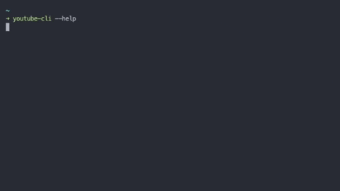

# YouTube CLI

## Motivation

On youtube there exist a lot of interesing mixes of songs which I really like, sometimes better than the original one. There are plenty of downloader tools available on the internet, but in my opinion they lack of simplicity and user experience.
Hence I decided to build a lightweight implementation of a youtube downloader. I used a cli based approach and for argument parsing I utilized `yargs`.



## Prerequisites

- Node.js >= v14.0.0

## Usage

1. Clone this repo and `cd` into it:

```bash
$ git clone https://github.com/Olgoetz/nodejs-youtube-cli.git
$ cd nodejs-youtube-cli
```

2. Run the following command:

```bash
$ npm install
```

3. Test the installation (the cli is globally available):

```bash
$ youtube-cli --help
```

4. After verification you can start with creating your config file:

```bash
$ youtube-cli config --audio="<yourAbsolutePathToAfolderForStoringDownloads"
```
